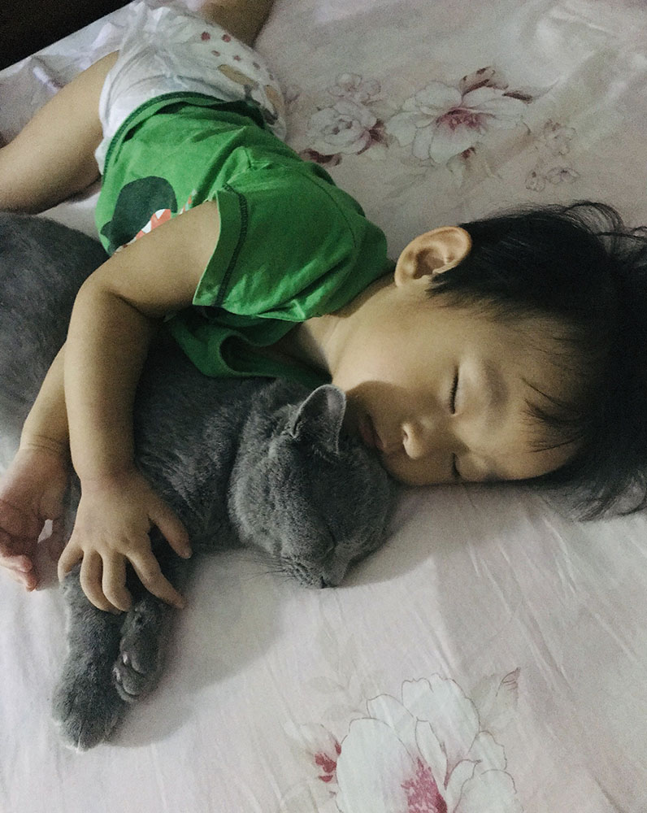
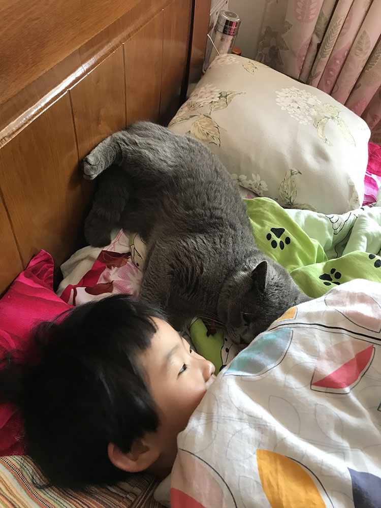
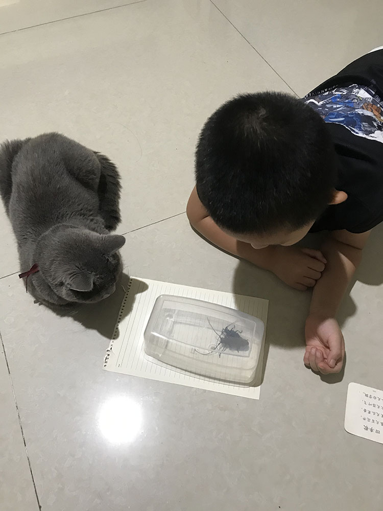

周日下午带着孩子在外面，一位邻居微信上告诉我附近有一只蓝猫受伤了问是不是我们家的，我赶紧让我爸去确认，然后盯着邻居发来的模糊的照片默默祈祷不要是大卫。

我爸到的时候它已经不行了，是被两条大狗咬死的，我爸把它抱回家埋在了院子里的柿子树下。

当天晚上，狗的主人带着跟孩子一起，拎了礼物上门赔礼道歉，态度诚恳、言语真挚，甚至眼睛里带着泪。我接受并打断了她的道歉，她蹲下跟我女儿继续道歉，拿出手机找出几张她朋友家刚出生的小猫让女儿选一个喜欢的她买来赔我们，我想了想这样可能对我们都是最好的处理方式，答应了并且让她把礼物带回去了。

两个小朋友大概还没有学会如何表达悲伤，只偶尔会冒出一句我想大卫了。能不想么？我们早就把它当做一名家庭成员了。女儿小小花现在四岁半，三年前一个夏天晚上我们饭后一起散步遇到的大卫，刚抱回来时它性格很野，胆小怕生处处警惕，但没过多久就跟两个小家伙热乎了，开始站在电视柜上扑向小小花抱住她的脸，或者趁她不注意从后面抱住她的脚，但它跟小小花打架的时候从不会伸出爪子。再后来它居然听得懂自己的名字了，我们喊一声大卫它若是心情好（或者饿了）就会立刻奔过来，不想理你的时候就抬头看你一眼然后继续眯回去。

我们家住一楼，出门就是小区健身区域加滑滑梯，俩小朋友每天进出几十回从不会随手关门，大卫胆子大点儿了就开始到院子里溜达，又过阵子在游乐场里也能看到它，就这样逐步扩大活动范围，甚至有一次我们去小区外面取个快递它跟着走了一路。渐渐的就再也关不住它了，看到门留了一条缝自己去推开出去，最近一年形成了固定的作息，早上出去绕一圈然后回家睡觉，晚上再出去绕一圈，爸妈每天晚上散步回来它准时蹲在门口等着一起进来。偶尔也会外面玩疯了的忘记回家，我妈说看不到它回来她都睡不着觉。

有一阵子我发现它变胖了，开始拉着它运动，在一根绳子上绑上一个毽子来回甩，它可以蹦到半人高来抓。那些天每天吃完饭我都要跟它玩个十几分钟，有几天天气热，玩累了它就瘫在地砖上哈赤哈赤的喘粗气。

大卫很喜欢给我们带回礼物，毛毛虫这种算小的，有一次我在地毯上发现一只咬破肚子的死老鼠，还有一次捉了一只麻雀躲起来吃掉了，最夸张的一次是衔着一只鸽子冲了进来，我妈看到连忙想赶它出去，它一看不妙转头往外跑，撞在门口的塑料门帘上，嘴巴一松鸽子飞走了，留下一地鸽子毛。

大卫不是一只粘人的猫，在我腿上从没有待超过五分钟过，有时候主动打着呼噜凑过来，一会儿就拍拍屁股走了。每天早上会叫我们起床，晚上睡觉前也会在门外叫一声，进来给我们摸摸然后出去窝里睡觉。吃饭的时候比他俩都更早坐到座位上，只露出两只耳朵在餐桌上。经常蹲在阳台飘窗往外看，大概是在观察树上的鸟。冬天喜欢趴在功放上面，因为那里暖和。

这两天在屋子里走动，不管走到哪儿都浮现出大卫出现在那里的样子，涌上来的那股悲伤情绪我已经很多很多年没有体会过了。俩小朋友说新的小猫来了还取名叫大卫，我说不可以，我要不管多少年之后回想起来，大卫还是那个大卫。

